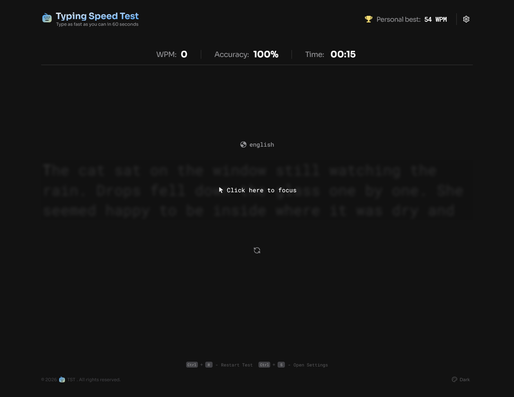
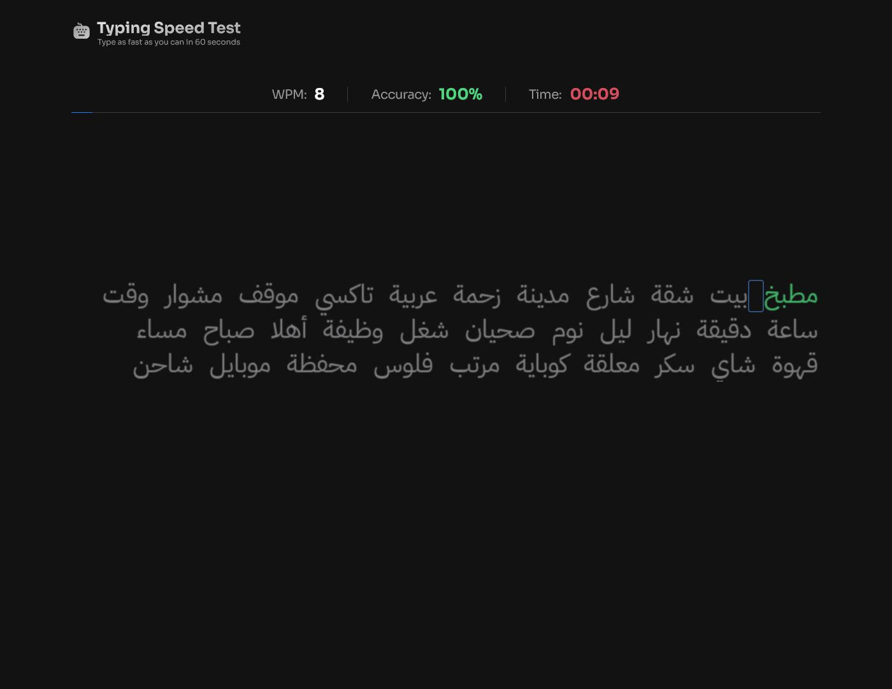
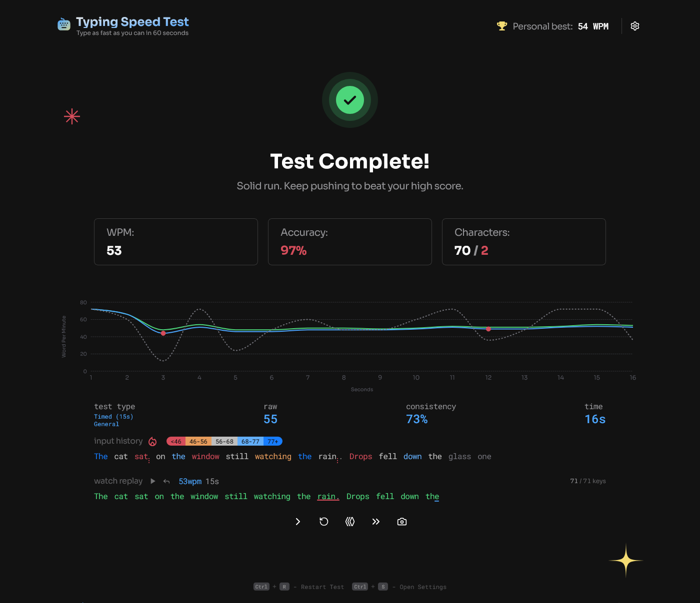

# Typing Speed Test ـــــــ TST

A modern, responsive, and feature-rich typing speed test application similar to the likes of [MonkeyType](https://monkeytype.com/) application built with Tanstack framework.

This project provides real-time feedback, detailed statistics, and a sleek user interface for improving typing skills.





### Links

- Solution URL: [Typing Speed Test](https://www.frontendmentor.io/challenges/typing-speed-test)
- Live Site URL: [tst.ayob.dev](https://tst.ayob.dev)

## Features

- **Real-time Feedback**: Instant visual cues for correct and incorrect characters.
- **Moving Textarea**: A professional-grade input system where the textarea follows the active word, ensuring native caret behavior across devices.
- **Advanced Accessibility**: Full screen-reader support with dynamic `aria-label` updates, `role` optimizations, and semantic navigation.
- **Bi-directional Support**: Full LTR and RTL (Arabic/Hebrew) support with correctly mirrored indicators.
- **Detailed Statistics**: Track your WPM (Words Per Minute), accuracy, and consistency.
- **Interactive Heatmap**: Visualize your typing performance across different sections of text.
- **Dynamic Charting**: View your progress over time with interactive charts powered by Recharts.
- **Customizable Themes**: Multiple themes to suit your preference, including dark and light modes.
- **Multi Language**: Practice Arabic, English, and more with quotes, code, and lyrics.
- **Responsive Design**: Optimized for everything from mobile phones to high-resolution desktops.

## Tech Stack

- **Core**: [Tanstack Start](https://tanstack.com/start/)
- **Styling**: [Tailwind CSS 4](https://tailwindcss.com/)
- **Database**: [MongoDB](https://www.mongodb.com/)
- **UI Components**: [Shadcn UI](https://ui.shadcn.com/)
- **Charts**: [Recharts](https://recharts.org/)
- **Tooling**: [Eslint](https://eslint.org/) (Linting/Formatting), [Vitest](https://vitest.dev/) (Testing)

## Getting Started

### Prerequisites

- Node.js (Latest LTS recommended)
- pnpm

### Installation

1. Clone the repository:

   ```bash
   git clone https://github.com/ahmadyousif89/tst.git
   cd tst
   ```

2. Install dependencies:

   ```bash
   pnpm install
   ```

3. Set up environment variables:
   Create a `.env` file in the root directory and add your MongoDB connection string.
   ```env
   MONGODB_URI=your_mongodb_connection_string
   ```

### Development

Run the development server:

```bash
pnpm dev
```

Open [http://localhost:3000](http://localhost:3000) with your browser to see the result.

### Testing

Run the test suite:

```bash
pnpm test
```

## What I Learned

Building this application was an excellent exercise for me to work on state management and performance optimization. Here are some of the key technical takeaways:

### Engine Core Logic

The application's heart is a decoupled logic layer found in `engine/logic.ts`. By separating the business logic from the React components, I ensured that the typing engine is predictable, easy to debug, and highly performant.

### Internal Mechanics

- **Coordinate Synchronization**: The engine dynamically calculates the `top`, `left`, and `width` of the active word in the DOM. It then syncs the hidden `textarea` to those exact coordinates, allowing for native browser features like the caret and mobile auto-zoom to work perfectly.
- **Keystroke Tracking**: Instead of just storing the current text, the engine maintains a comprehensive log of every `Keystroke`. This enables features like replaying a session, rendering a heatmap and calculating sub-second consistency metrics.
- **State Reconstruction**: The UI state is dynamically reconstructed from the keystroke log. This "event-sourcing" approach allows the engine to handle complex backspacing scenarios and "extra" characters (characters typed beyond the original word length) with perfect accuracy.
- **Smart Cursor Management**: The engine implements professional typing mechanics, including "word skipping" when pressing space mid-word and cursor locking to prevent backspacing into already typed, correct words.

### Accessibility & Internationalization

A major focus was ensuring the app is usable for everyone. I implemented `aria-live` regions and dynamic `aria-labels` that update as the user moves between words. For **RTL support (Arabic)**, the engine performs complex calculations to mirror the input positioning while maintaining a stable user experience.

### Testing Strategy

I utilized **Vitest** to build a robust suite of unit and integration tests. Testing the typing engine required covering numerous edge cases, such as:

- **State Neutralization**: Ensuring character colors correctly reset to their original state after multiple backspaces.
- **Input Robustness**: Verifying that the engine handles rapid input and modifier keys (like Ctrl+Backspace) without losing synchronization.
- **Formula Accuracy**: Confirming that WPM and accuracy calculations match industry standards across various session lengths.
- **Word Range Logic**: Unit testing the complex boundary detection for words and relative cursor positioning.

## Continued Development

While the core typing experience is solid, I plan to expand the project with the following features:

- **User Authentication**: Implementing a full auth system to allow users to save their progress, track long-term statistics, and customize their profiles.
- **Global Leaderboard**: A competitive leaderboard where users can compare their speeds across different categories (Quotes, Code, Lyrics) and difficulty levels.

## License

This project is licensed under the MIT License - see the [LICENSE](LICENSE) file for details.

## Author

- **Ahmad Yousif** - [GitHub](https://github.com/ahmadyousif89)
